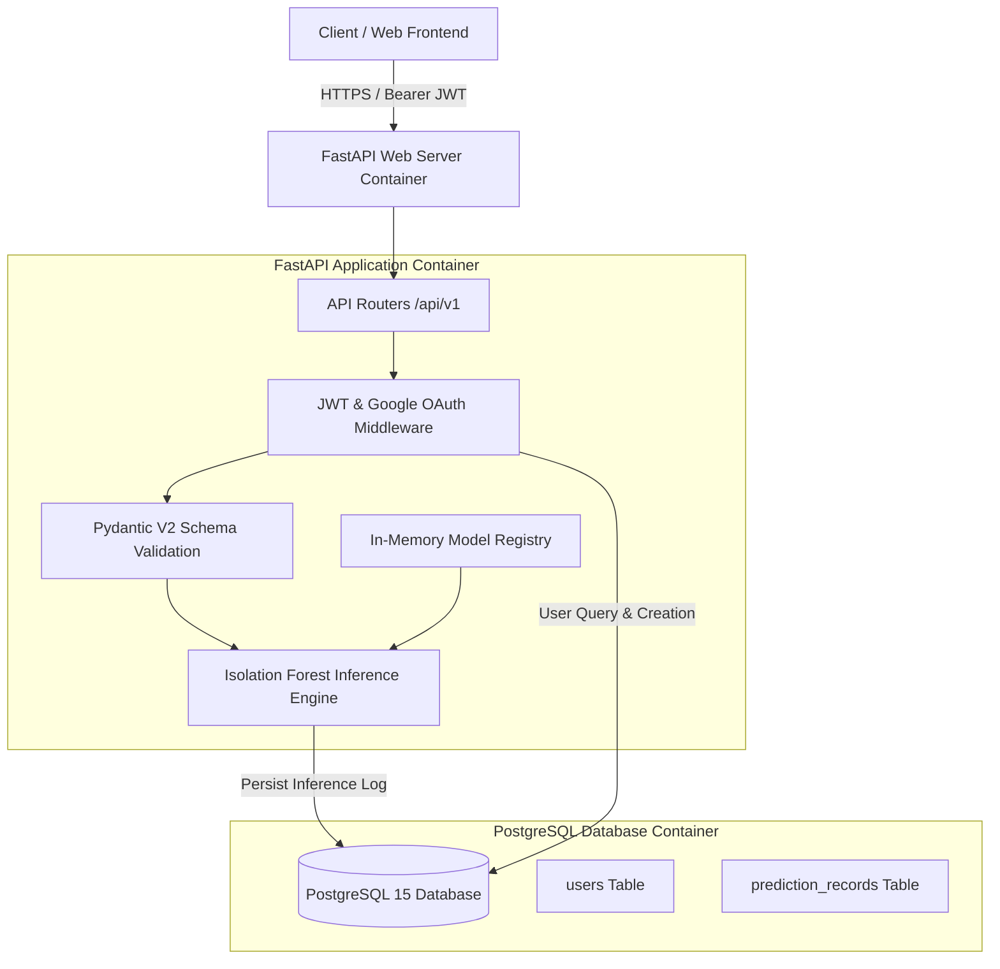
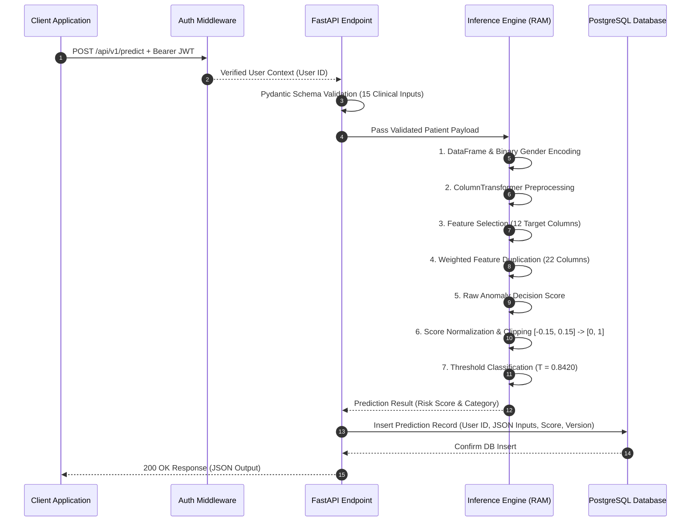

# System Design & MLOps Architecture: Rebone AI

This document provides a comprehensive technical overview of the production REST API, database schema, containerization architecture, and MLOps model serving design for **Rebone AI**.

---

## 1. System Architecture Overview

Rebone AI is built as a multi-container microservice system orchestrated via Docker Compose. The architecture separates the API web layer from database persistence, ensuring high availability, stateless request handling, and clinical auditability.



---

## 2. Request & Inference Lifecycle

Every prediction request sent to `/api/v1/predict` undergoes strict data validation, in-memory model transformation, anomaly scoring, and database audit logging.



---

## 3. Key System Design Decisions

### 3.1 Asynchronous Web Framework: FastAPI
* **Performance**: Built on ASGI (Starlette and Pydantic v2), supporting high-concurrency request processing via Python's native `async/await` event loop.
* **Automatic Contract Generation**: Generates standard OpenAPI 3.0 specifications and interactive documentation (`/docs`) directly from Python type hints.
* **Payload Protection**: Pydantic schema validation intercepts malformed payloads at the HTTP boundary, returning `422 Unprocessable Entity` responses before invalid types reach numeric matrix calculations.

### 3.2 Relational Persistence: PostgreSQL 15
* **Relational Integrity**: Enforces foreign key relationships between user accounts (`users.id`) and historical predictions (`prediction_records.user_id`).
* **Semi-Structured Auditing (JSONB)**: The `clinical_inputs` column stores full 15-field patient dictionaries natively. This allows arbitrary clinical input formats while maintaining structured relational indexes on `user_id` and `created_at`.
* **Connection Pooling**: Implemented via SQLAlchemy 2.0 with pre-ping validation (`pool_size=10`, `max_overflow=20`), preventing database connection exhaustion under burst traffic.

### 3.3 Security & Authentication Architecture
* **Stateless Authorization (JWT)**: Signed HMAC SHA-256 (`HS256`) access tokens carry user identities statelessly. This eliminates session lookup latency on every request and enables horizontal scaling.
* **Password Hashing**: Direct `bcrypt` hashing with salt generation ensures user passwords are never stored in plain text.
* **Google OAuth 2.0 SSO**: Verification of Google ID tokens against Google's public tokeninfo endpoint (`https://oauth2.googleapis.com/tokeninfo`). Successfully verified accounts are automatically provisioned in PostgreSQL with `auth_provider="google"`.

---

## 4. MLOps Model Serving Architecture

### 4.1 Lifespan Artifact Management
Loading machine learning model binaries off disk during an HTTP request causes severe latency spikes and disk I/O bottlenecks. Rebone AI implements an in-memory lifespan model loader:

1. On server boot (`uvicorn src.api.main:app`), FastAPI's `lifespan` handler deserializes `preprocessing_pipeline.joblib` and `isolation_forest.joblib` into memory.
2. The model object, feature selection lists, and weighted column lists are cached in global application memory.
3. During request handling, inference runs against memory references in sub-millisecond execution times.

### 4.2 Deterministic 7-Step Inference Engine

The inference engine strictly mirrors the experimental R&D preprocessing sequence:

| Step | Operation | Description |
|---|---|---|
| 1 | DataFrame Conversion | Converts Pydantic payload to 1-row DataFrame; encodes Gender string ("Female"/"Male") to binary (1/0). |
| 2 | Pipeline Transformation | Executes fitted `ColumnTransformer` (median imputation for missing values and standard scaling). |
| 3 | Feature Selection | Filters array to the 12 clinical features expected by Isolation Forest. |
| 4 | Weighted Feature Duplication | Appends `_dup1` and `_dup2` columns for 5 high-impact features (`VT`, `VD`, `OP`, `Calcitriol`, `Calcitonin`), expanding shape to 22 columns. |
| 5 | Anomaly Decision Scoring | Evaluates negative decision function: `raw_score = -model.decision_function(df_weighted)[0]`. |
| 6 | Normalization & Clipping | Maps raw score to $[0.0, 1.0]$ via `SCORE_MIN = -0.1500` and `SCORE_MAX = 0.1500`. |
| 7 | Threshold Classification | Assigns "High Risk / Anomaly Detected" if `normalized_score >= 0.8420`, otherwise "Low Risk / Normal". |

---

## 5. Database Schema Reference

```sql
-- Users Table
CREATE TABLE users (
    id SERIAL PRIMARY KEY,
    email VARCHAR UNIQUE NOT NULL,
    hashed_password VARCHAR NULL,
    full_name VARCHAR NULL,
    auth_provider VARCHAR NOT NULL DEFAULT 'local',
    created_at TIMESTAMP NOT NULL DEFAULT CURRENT_TIMESTAMP
);

-- Prediction Records Table (MLOps Audit Log)
CREATE TABLE prediction_records (
    id SERIAL PRIMARY KEY,
    user_id INTEGER NOT NULL REFERENCES users(id) ON DELETE CASCADE,
    clinical_inputs JSON NOT NULL,
    risk_score FLOAT NOT NULL,
    prediction_label INTEGER NOT NULL,
    model_version VARCHAR NOT NULL DEFAULT 'isolation_forest_v1.0',
    created_at TIMESTAMP NOT NULL DEFAULT CURRENT_TIMESTAMP
);

CREATE INDEX ix_users_email ON users(email);
CREATE INDEX ix_prediction_records_user_id ON prediction_records(user_id);
```

---

## 6. Containerization & Deployment

The application is containerized using multi-stage Docker builds and managed via Docker Compose:

* **Web Service Container (`rebone_fastapi_web`)**:
  * Base Image: `python:3.10-slim`
  * Process Manager: `uvicorn` (ASGI web server)
  * Mount Volume: Live-reloading source code directory.
* **Database Container (`rebone_postgres_db`)**:
  * Base Image: `postgres:15-alpine`
  * Healthcheck: `pg_isready` polling every 5 seconds.
  * Volume: Named volume `postgres_data` for database persistence.
